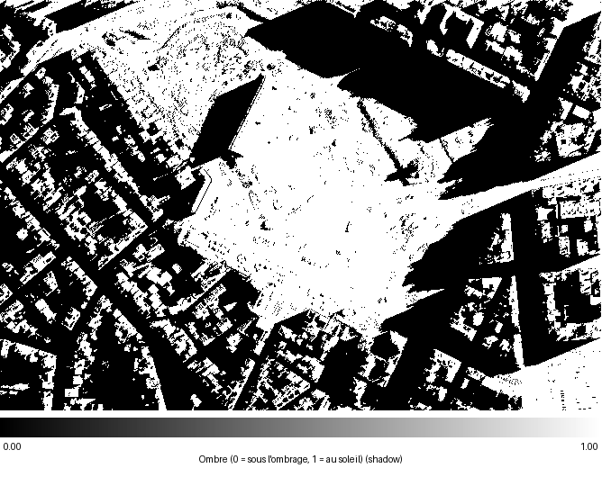
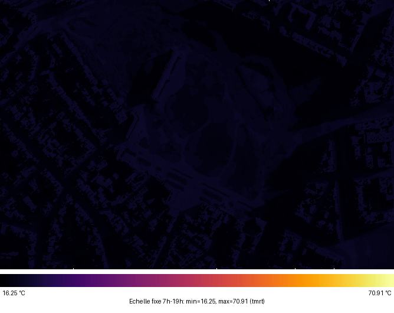
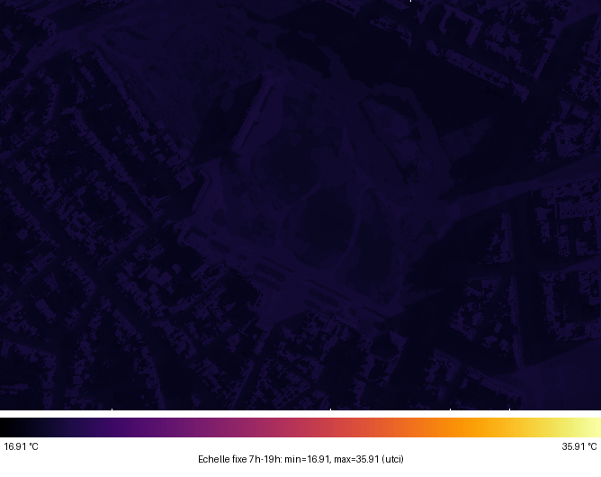

# pymdurs

[](https://pypi.org/project/pymdurs/) [](https://pypi.org/project/pymdurs/)

**Python bindings** for the Rust library `rsmdu` — a high-performance reimplementation of [pymdu](https://github.com/UMEP-dev/pymdu) (Python Urban Data Model). Geospatial data processing for urban analysis, with integration with IGN (Institut Géographique National) APIs and UMEP toolchains.

- **PyPI package**: [pypi.org/project/pymdurs](https://pypi.org/project/pymdurs/)
- **Latest version**: [](https://pypi.org/project/pymdurs/)

| Shadow | Mean radiant temperature (Tmrt) | Thermal comfort (UTCI) |
| :----: | :-----------------------------: | :--------------------: |
|  |  |  |

---


## 📋 Table of Contents

- [Installation](#installation)
- [Quick Start](#quick-start)
- [Core Classes](#core-classes)
- [Geometric Data Modules](#geometric-data-modules)
- [Requirements](#requirements)
- [UMEP Integration](#umep-integration)
- [Examples](#examples)
- [API Reference](#api-reference)
- [Versions and releases](#versions-and-releases)

---

## Installation

### Install uv

[uv](https://docs.astral.sh/uv/) is the Python package manager used by this project (see `uv.lock`). Recommended installation via the standalone [Astral](https://docs.astral.sh/uv/getting-started/installation/) installer:

**macOS / Linux:**

```bash
curl -LsSf https://astral.sh/uv/install.sh | sh
```

**Windows (PowerShell):**

```powershell
powershell -ExecutionPolicy ByPass -c "irm https://astral.sh/uv/install.ps1 | iex"
```

**Other methods:** Homebrew (`brew install uv`), pipx (`pipx install uv`), or [PyPI](https://pypi.org/project/uv/).

After installation, restart your terminal. Update: `uv self update` (standalone installer only).

Create a virtual environment:

```bash
uv venv .venv --python 3.13
```

### From PyPI (recommended)

The package is published on [PyPI](https://pypi.org/project/pymdurs/). To install the latest version:

```bash
uv pip install pymdurs
```

On **Windows**, the PyPI wheel bundles GDAL, GEOS, and PROJ via `auditwheel repair` — no system GDAL installation is required.

For a specific version (see the [PyPI release history](https://pypi.org/project/pymdurs/#history)):

```bash
uv pip install "pymdurs==<version>"
```

### From source

**GDAL prerequisites** (build only — not required for `pip install pymdurs` on Windows):

| Platform    | Command                                                                                                                                                            |
| ----------- | ------------------------------------------------------------------------------------------------------------------------------------------------------------------ |
| **macOS**   | `brew install gdal` or `ARCHFLAGS="-arch arm64" uv pip install --no-cache-dir gdal`                                                                                |
| **Linux**   | `sudo apt-get update && sudo apt-get install -y libgdal-dev gdal-bin libclang-dev`                                                                                 |
| **Windows** | [OSGeo4W](https://trac.osgeo.org/osgeo4w/) (GDAL, GEOS, PROJ, SQLite3) + `choco install llvm pkgconfiglite sqlite -y` + set `GDAL_HOME`, `PKG_CONFIG_PATH`, `PATH` |

**Prerequisites: Rust** (required to build):

**Windows:**

```bash
# Download and run rustup-init.exe from https://rustup.rs/
# Or use PowerShell:
Invoke-WebRequest -Uri https://win.rustup.rs/x86_64 -OutFile rustup-init.exe
.\rustup-init.exe
```

**macOS:**

```bash
curl --proto '=https' --tlsv1.2 -sSf https://sh.rustup.rs | sh
```

**Linux:**

```bash
curl --proto '=https' --tlsv1.2 -sSf https://sh.rustup.rs | sh
```

After installation, restart your terminal or run:

```bash
source $HOME/.cargo/env
```

**Build (maturin develop)**

| Platform                  | Target                      | Command                                                                  |
| ------------------------- | --------------------------- | ------------------------------------------------------------------------ |
| **macOS** (Apple Silicon) | `aarch64-apple-darwin`      | `maturin develop --target aarch64-apple-darwin`                          |
| **macOS** (Intel)         | `x86_64-apple-darwin`       | `maturin develop --target x86_64-apple-darwin`                           |
| **Linux** (x86_64)        | `x86_64-unknown-linux-gnu`  | `maturin develop --target x86_64-unknown-linux-gnu` or `maturin develop` |
| **Linux** (ARM64)         | `aarch64-unknown-linux-gnu` | `maturin develop --target aarch64-unknown-linux-gnu`                     |
| **Windows**               | `x86_64-pc-windows-msvc`    | `maturin develop --target x86_64-pc-windows-msvc`                        |

With uv: `uv run maturin develop --target <target>`

**macOS: linker can't find GDAL / "library 'gdal' not found"**  
If you upgraded GDAL or PROJ with Homebrew, the linker may still use old paths. Clean and point pkg-config at the current install, then rebuild:

```bash
cd pymdurs && cargo clean && cd ..
export PKG_CONFIG_PATH="/opt/homebrew/lib/pkgconfig"
maturin develop --target aarch64-apple-darwin
```

**Build and install:**

```bash
# Clone the repository
git clone https://github.com/rupeelab17/pymdurs.git
cd pymdurs

# Install maturin (Python-Rust build tool)
uv pip install maturin

# Build and install pymdurs
cd pymdurs

# For Apple Silicon (ARM64) - use native target
maturin develop --target aarch64-apple-darwin

# For Intel Mac (x86_64) - use default or specify target
maturin develop --target x86_64-apple-darwin

# Or let maturin auto-detect (may require rustup for cross-compilation)
maturin develop
```

**Note**: On Apple Silicon, if you get an error about missing `x86_64-apple-darwin` target, use `--target aarch64-apple-darwin` explicitly.

---

## Quick Start

```python
import pymdurs

# Create a BuildingCollection
buildings = pymdurs.geometric.Building(
    output_path="./output",
    defaultStoreyHeight=3.0
)

# Set bounding box (WGS84 coordinates)
buildings.set_bbox(-1.152704, 46.181627, -1.139893, 46.18699)

# Set CRS (optional, defaults to EPSG:2154 for France)
buildings.set_crs(2154)

# Download and process buildings from IGN API
buildings = buildings.run()

# Convert to pandas DataFrame
df = buildings.to_pandas()
print(df.head())
```

---

## Core Classes

### `PyBoundingBox`

Represents a geographic bounding box with min/max coordinates.

```python
bbox = pymdurs.PyBoundingBox(min_x=-1.15, min_y=46.18, max_x=-1.14, max_y=46.19)
```

### `GeoCore` / `PyGeoCore`

Base class providing common geospatial functionality (CRS, output paths, etc.).

```python
# Access GeoCore from any geometric module
buildings = pymdurs.geometric.Building(output_path="./output")
geo = buildings.geo_core
print(f"CRS: EPSG:{geo.epsg}")
print(f"Output path: {geo.output_path}")
```

---

## Geometric Data Modules

All geometric modules follow a similar API pattern:

1. Create an instance with `output_path`
2. Set bounding box with `set_bbox(min_x, min_y, max_x, max_y)` (WGS84)
3. Optionally set CRS with `set_crs(epsg_code)`
4. Run processing with `run()` or module-specific methods
5. Access results via `get_geojson()`, `to_pandas()`, or file paths

### 🏢 Building / BuildingCollection

Load and process building data from Shapefiles, GeoJSON, or IGN API.

```python
import pymdurs

# Create BuildingCollection
buildings = pymdurs.geometric.Building(
    output_path="./output",
    defaultStoreyHeight=3.0
)

# Set bounding box (WGS84)
buildings.set_bbox(-1.152704, 46.181627, -1.139893, 46.18699)

# Set CRS (optional)
buildings.set_crs(2154)

# Download from IGN API and process
buildings = buildings.run()

# Convert to pandas DataFrame
df = buildings.to_pandas()

# Access GeoCore
geo = buildings.geo_core
print(f"CRS: EPSG:{geo.epsg}")
```

**Features:**

- Automatic height processing (storeys × default height or alternative height field)
- Mean district height calculation (weighted by area)
- Integration with pandas for tabular operations
- Support for multiple input formats (Shapefile, GeoJSON, IGN API)

---

### 🗻 DEM (Digital Elevation Model)

Download and process DEM data from IGN API via WMS-R.

```python
import pymdurs

# Create Dem instance
dem = pymdurs.geometric.Dem(output_path="./output")

# Set bounding box (WGS84)
dem.set_bbox(-1.152704, 46.181627, -1.139893, 46.18699)

# Set CRS (optional)
dem.set_crs(2154)

# Run DEM processing (downloads from IGN WMS-R)
dem = dem.run()

# Get output paths
tiff_path = dem.get_path_save_tiff()
mask_path = dem.get_path_save_mask()

print(f"DEM saved to: {tiff_path}")
print(f"Mask saved to: {mask_path}")
```

**Features:**

- Automatic download from IGN WMS-R service
- GeoTIFF generation with proper CRS
- Mask generation for DEM boundaries
- Optional shape parameter for resampling

---

### 📋 Cadastre

Download cadastral parcel data from IGN API via WFS.

```python
import pymdurs

# Create Cadastre instance
cadastre = pymdurs.geometric.Cadastre(output_path="./output")

# Set bounding box (WGS84)
cadastre.set_bbox(-1.152704, 46.181627, -1.139893, 46.18699)

# Set CRS (optional)
cadastre.set_crs(2154)

# Download from IGN API
cadastre = cadastre.run()

# Get GeoJSON data
geojson = cadastre.get_geojson()

# Save to GeoJSON file
cadastre.to_geojson(name="cadastre")
```

---

### 📊 IRIS (Statistical Units)

Download IRIS statistical units from IGN API via WFS.

```python
import pymdurs

# Create Iris instance
iris = pymdurs.geometric.Iris(output_path="./output")

# Set bounding box (WGS84)
iris.set_bbox(-1.152704, 46.181627, -1.139893, 46.18699)

# Set CRS (optional)
iris.set_crs(2154)

# Download from IGN API
iris = iris.run()

# Get GeoJSON data
geojson = iris.get_geojson()

# Save to GeoJSON file
iris.to_geojson(name="iris")
```

---

### 🌳 COSIA (Land Cover)

Download COSIA land-cover data from the IGN API.

```python
import pymdurs

# Create Cosia instance
cosia = pymdurs.geometric.Cosia(output_path="./output")

# Set bounding box (WGS84)
cosia.set_bbox(-1.152704, 46.181627, -1.139893, 46.18699)

# Set CRS (optional)
cosia.set_crs(2154)

# Download from IGN API
cosia = cosia.run_ign()

# Get output path
tiff_path = cosia.get_path_save_tiff()
print(f"COSIA raster saved to: {tiff_path}")
```

**Note:** COSIA data is downloaded as a raster TIFF. See `examples/cosia_from_ign.py` for a complete workflow including vectorization and conversion to UMEP format.

---

### 🛰️ LiDAR

Download and process LiDAR point cloud data from IGN WFS service.

```python
import pymdurs

# Create Lidar instance
lidar = pymdurs.geometric.Lidar(output_path="./output")

# Set bounding box (WGS84)
lidar.set_bbox(-1.154894, 46.182639, -1.148361, 46.186820)

# Set CRS (optional)
lidar.set_crs(2154)

# Generate CDSM from vegetation and water classes
classification_list = [3, 4, 5, 9]  # Vegetation and water
lidar.run(file_name="CDSM.tif", classification_list=classification_list)

# Generate DSM from ground and buildings classes
classification_list = [2, 6]  # Ground and buildings
output_path = lidar.run(file_name="DSM.tif", classification_list=classification_list)

print(f"DSM saved to: {output_path}")
# Output contains 3 bands: DSM, DTM, CHM
```

**Features:**

- Downloads LAZ files from IGN WFS service
- Processes point clouds to create DSM, DTM, and CHM rasters
- Filters by LiDAR classification classes
- Outputs multi-band GeoTIFF files

**LiDAR Classification Classes:**

- `2` = Ground
- `3` = Low Vegetation
- `4` = Medium Vegetation
- `5` = High Vegetation
- `6` = Buildings
- `9` = Water

---

### 🏢 RNB (French National Building Registry)

Download building data from RNB API.

```python
import pymdurs

# Create Rnb instance
rnb = pymdurs.geometric.Rnb(output_path="./output")

# Set bounding box (WGS84)
rnb.set_bbox(-1.152704, 46.181627, -1.139893, 46.18699)

# Set CRS (optional)
rnb.set_crs(2154)

# Download from RNB API
rnb = rnb.run()

# Get GeoJSON data
geojson = rnb.get_geojson()

# Save to GPKG file
rnb.to_geojson(name="rnb")
```

---

### 🛣️ Road

Download road segment data from IGN API.

```python
import pymdurs

# Create Road instance
road = pymdurs.geometric.Road(output_path="./output")

# Set bounding box (WGS84)
road.set_bbox(-1.152704, 46.181627, -1.139893, 46.18699)

# Set CRS (optional)
road.set_crs(2154)

# Download from IGN API
road = road.run()

# Get GeoJSON data
geojson = road.get_geojson()

# Save to GeoJSON file
road.to_geojson(name="road")
```

---

### 🌳 Vegetation

Calculate vegetation from IGN IRC images using NDVI (Normalized Difference Vegetation Index).

```python
import pymdurs

# Create Vegetation instance
vegetation = pymdurs.geometric.Vegetation(
    output_path="./output",
    write_file=False,
    min_area=0.0
)

# Set bounding box (WGS84)
vegetation.set_bbox(-1.152704, 46.181627, -1.139893, 46.18699)

# Set CRS (optional)
vegetation.set_crs(2154)

# Process vegetation (downloads IRC, calculates NDVI, filters)
vegetation = vegetation.run()

# Get GeoJSON data
geojson = vegetation.get_geojson()

# Save to GeoJSON file
vegetation.to_geojson(name="vegetation")
```

**Features:**

- Downloads IRC (Infrared Color) images from IGN API
- Calculates NDVI = (NIR - Red) / (NIR + Red)
- Filters pixels with NDVI < 0.2
- Polygonizes raster and filters by minimum area

---

### 💧 Water

Download water body data from IGN API.

```python
import pymdurs

# Create Water instance
water = pymdurs.geometric.Water(output_path="./output")

# Set bounding box (WGS84)
water.set_bbox(-1.152704, 46.181627, -1.139893, 46.18699)

# Set CRS (optional)
water.set_crs(2154)

# Download from IGN API
water = water.run()

# Get GeoJSON data
geojson = water.get_geojson()

# Save to GeoJSON file
water.to_geojson(name="water")
```

---

### 🌡️ LCZ (Local Climate Zone)

Load Local Climate Zone data from external sources.

```python
import pymdurs

# Create Lcz instance
lcz = pymdurs.geometric.Lcz(output_path="./output")

# Set bounding box (WGS84)
lcz.set_bbox(-1.152704, 46.181627, -1.139893, 46.18699)

# Load from URL (zip file containing shapefiles)
lcz = lcz.run()

# Get GeoJSON data
geojson = lcz.get_geojson()

# Get LCZ color table
table_color = lcz.get_table_color()

# Save to GeoJSON file
lcz.to_geojson(name="lcz")
```

**Features:**

- Loads LCZ data from zip URLs
- Built-in LCZ color table (17 LCZ types)
- Spatial filtering by bounding box
- Shapefile support (requires GDAL)

---

## Requirements

### Python

- **Python >= 3.8**
- **pandas >= 1.0.0**
- **numpy < 2.0.0** (for compatibility with numexpr and other dependencies)

**Note**: If you encounter NumPy 2.x compatibility issues, install NumPy 1.x:

```bash
uv pip install 'numpy<2.0.0'
```

### Optional Dependencies

For advanced workflows and examples:

```bash
# Geospatial operations
uv pip install geopandas rasterio pyproj shapely

# For UMEP integration
uv pip install "solweig @ git+https://github.com/UMEP-dev/solweig.git"
uv pip install umep  # Optional
```

---

## UMEP Integration

The full UMEP workflow runs in **two steps** under `examples/`, using the same output directory (`./output/umep_workflow`) and the same study area (La Rochelle bbox by default).

### Step 1 — Land cover (`cosia_from_ign.py`)

Downloads the **COSIA** orthophoto from the IGN API, vectorizes polygons by RGB color, reclassifies them to UMEP format (buildings, vegetation, water, etc.), and produces:

- `landcover.tif` — land-cover raster compatible with SOLWEIG
- `terrain.shp`, `terrain.geojson` — vector subset (bare soil and impervious surfaces)

```bash
python examples/cosia_from_ign.py
```

### Step 2 — Thermal analysis (`umep_workflow_new.py`)

Builds on step 1 outputs and collects the remaining urban data via `pymdurs`:

1. **DEM** from the IGN API
2. **DSM / CDSM** from IGN LiDAR (WFS)
3. Clip rasters to the mask (`DEM_clip.tif`, `DSM_clip.tif`, `CDSM_clip.tif`, `landcover_clip.tif`)
4. **SOLWEIG** (`solweig`): sky view factor (SVF), Tmrt, thermal comfort (UTCI)

`umep_workflow_new.py` expects `landcover.tif` in `./output/umep_workflow/`. Without that file, the SOLWEIG step is skipped (a warning is printed).

```bash
# On Apple Silicon (ARM64), add the x86_64 Rust target first:
rustup target add x86_64-apple-darwin

# Install solweig:
uv pip install "solweig @ git+https://github.com/UMEP-dev/solweig.git"

# Run the workflow (after cosia_from_ign.py):
python examples/umep_workflow_new.py
```

**Note:** `solweig` currently requires the `x86_64-apple-darwin` Rust target even on Apple Silicon — a limitation of the `solweig` package itself. Place a weather EPW file (e.g. `la_rochelle_2025.epw`) in `examples/` for the SOLWEIG step.

**Main outputs:** clipped rasters, PNG/GIF previews, Tmrt/UTCI time series in `./output/umep_workflow/`.

---

## Examples

Comprehensive examples are available in the `examples/` directory:

- **Basic usage**: `building_basic.py`
- **IGN API integration**: `building_from_ign.py`, `dem_from_ign.py`, `cadastre_from_ign.py`, etc.
- **LiDAR processing**: `lidar_from_wfs.py`
- **COSIA workflow**: `cosia_from_ign.py`
- **UMEP workflow**: `umep_workflow_new.py` (complete urban analysis workflow)

See [examples/README.md](examples/README.md) for detailed documentation of all examples.

---

## Typage (IDE)

Le package est annoté (PEP 561) via `py.typed` et des stubs `.pyi` générés depuis les bindings PyO3.

Après modification d’un binding Rust :

```bash
./scripts/generate-stubs.sh
```

Vérification locale :

```bash
uv run basedpyright pymdurs examples
```

Les stubs commités (`pymdurs/pymdurs.pyi`, `pymdurs/geometric/`, `pymdurs/thermal/`) sont contrôlés en CI (workflow `type-stubs.yml`).

---

## API Reference

### Common Methods

All geometric modules share these common methods:

#### `set_bbox(min_x: float, min_y: float, max_x: float, max_y: float)`

Set the bounding box in WGS84 (EPSG:4326) coordinates.

```python
module.set_bbox(-1.152704, 46.181627, -1.139893, 46.18699)
```

#### `set_crs(epsg: int)`

Set the coordinate reference system (CRS) using EPSG code.

```python
module.set_crs(2154)  # Lambert 93 (France)
```

#### `geo_core: GeoCore`

Access the GeoCore instance for CRS and path information.

```python
geo = module.geo_core
print(f"CRS: EPSG:{geo.epsg}")
print(f"Output path: {geo.output_path}")
```

### Module-Specific Methods

#### Building

- `run() -> Building` - Download and process buildings
- `to_pandas() -> pandas.DataFrame` - Convert to pandas DataFrame

#### Dem

- `run(shape: Optional[Tuple[int, int]] = None) -> Dem` - Download and process DEM
- `get_path_save_tiff() -> str` - Get DEM GeoTIFF path
- `get_path_save_mask() -> str` - Get mask shapefile path

#### Cadastre, Iris, Road, Rnb, Water, Vegetation

- `run() -> Self` - Download and process data
- `get_geojson() -> dict` - Get GeoJSON data
- `to_geojson(name: str) -> None` - Save to GeoJSON file

#### Cosia

- `run_ign() -> Cosia` - Download COSIA from IGN API
- `get_path_save_tiff() -> str` - Get COSIA raster path

#### Lidar

- `run(file_name: str, classification_list: List[int]) -> str` - Process LiDAR data
- Returns path to output GeoTIFF file

#### Lcz

- `run() -> Lcz` - Load LCZ data
- `get_table_color() -> dict` - Get LCZ color table

---

## Notes

### API Aliases

Both Pythonic aliases and original class names are available:

- `Building` / `PyBuilding`
- `Dem` / `PyDem`
- `Cadastre` / `PyCadastre`
- `Iris` / `PyIris`
- `Lcz` / `PyLcz`
- `PyBoundingBox`
- `GeoCore` / `PyGeoCore`
- etc.

### Coordinate Systems

- **Input coordinates**: Must be in WGS84 (EPSG:4326) for IGN API
- **Default CRS**: EPSG:2154 (Lambert 93) for French data
- **Output CRS**: Can be customized with `set_crs()`

### IGN API Limitations

- **Rate limiting**: The IGN API may have rate limits
- **Data availability**: Some data may not be available for all areas
- **Internet connection**: Required for all IGN API operations

---

## Versions and releases

The version is synchronized across `pyproject.toml`, `pymdurs/Cargo.toml`, and `rsmdu/Cargo.toml`.

- **Set a version**: `./scripts/set-version.sh 0.1.2`
- **Bump (patch/minor/major)**: `./scripts/bump-version.sh patch`
- **Release (bump + commit + tag)**: `./scripts/bump-version.sh patch --tag` then `git push && git push origin py-X.Y.Z`

See [docs/VERSIONING.md](docs/VERSIONING.md) for details.

---

## Support

- [**PyPI – pymdurs**](https://pypi.org/project/pymdurs/) — project page and release history
- [**GitHub – pymdurs**](https://github.com/rupeelab17/pymdurs) — source repository (Rust crate `rsmdu` + Python bindings)
- [Examples README](examples/README.md) — detailed examples
- [Versioning](docs/VERSIONING.md)
- [IGN Documentation](https://geoservices.ign.fr/documentation/services)
